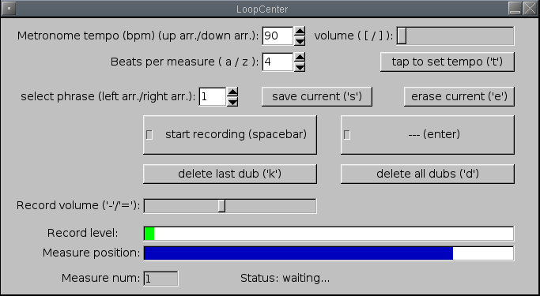

# Loopcenter

## What it is

Loopcenter is a program I wrote basically as a music-practicing tool. I didn't want to shell out for a Boss Loop Station guitar pedal, and I figured I could achieve the same functionality pretty easily with a simple program. The result was 'Loopcenter'.

Loopcenter lets you simply record loops for any audio you route to it (via JACK), and it plays it back in a loop. You can overdub the loop as well. Every recording is rounded to the nearest measure. Accordingly, you can adjust the beats per measure, and the tempo.

I usually use loopcenter to practice improvising over a chord sequence.

## What it requires

Loopcenter compiles on linux and Mac OS X. It uses the JACK audio server for getting sound in and out. The following libraries are required:

* JACK ([http://jackaudio.org](http://jackaudio.org/))
* FLTK (for the GUI) ([http://www.fltk.org](http://www.fltk.org/))

## What it looks like

Pretty basic, but functional:



## How to get it

Download Loopcenter from the [Sourceforge download page](http://sourceforge.net/project/showfiles.php?group_id=200387).

## How to install it

The usual linux install; make sure you have JACK and FLTK installed, then:

```
./configure
make
su
make install
```

## How to use it

Start the program by typing:

```
loopcenter
```

at the command line. It automatically should connect to your sound card, but fiddle with the JACK connections if you need to. Adjust the tempo; you can tap the tempo by repeatedly pressing the 't' key until you get the tempo you want. Set the desired number of beats per measure.

When you're ready to record, hit the "start recording" button or the spacebar. If this is the first "layer" of recording (i.e. not an overdub, but the base track), **the program gives you one warm-up measure** before it begins recording. After recording, hit the spacebar again. The program will loop what you just played. You can record subsequent overdubs by using the spacebar again. If you are unhappy with your recording, hit "erase current" and try again.

If you would like to save your track, hit "save current". Then you can change the selected phrase and record other phrases, and return to your original saved track later.

## Misc

I wrote this program before I knew about [SooperLooper](http://essej.net/sooperlooper/), another looping program which has similar (but more) functionality; I highly encourage you to check it out.
Loopcenter might be a bit simpler to use, though.

Loopcenter's audio I/O was done with the [RtAudio](http://www.music.mcgill.ca/~gary/rtaudio/) library, which allows one to develop cross-platform audio applications for Mac, linux, or windows with the same code.
In principle, Loopcenter could be compiled for windows, since the GUI library, FLTK, is also cross-plaform, but I haven't been able to do so.
If someone was interested in doing this, that would be pretty neat, but I don't have enough experience getting this sort of stuff to work in windows.

Nick Choly \<ncholy "at" gmail "dOt" com\>
